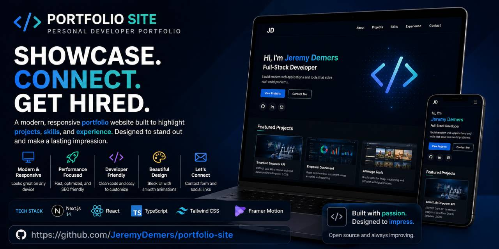

# Jeremy Demers Portfolio

<p align="center">
  
</p>

The source and AWS infrastructure for [jeremysdemers.com](https://jeremysdemers.com). The site introduces Jeremy's work and provides a shared home for the Arcade games and Digital Twin project.

## Local development

Requirements: Node.js 22 or newer.

```bash
npm install
cp .env.example .env.local
npm run dev
```

Open `http://localhost:3000`. Production builds are exported as static files beneath `out/`.

Tetris and Neon Shatter are fully playable without a backend. Their Google sign-in, saved scores, statistics, and leaderboards activate when the existing Arcade APIs are running at the URLs configured in `.env.local`. Digital Twin chat similarly uses `NEXT_PUBLIC_TWIN_API_URL`.

## Quality checks

```bash
npm run lint
npm run build
```

## AWS architecture

Terraform provisions:

- A private, encrypted, versioned S3 site bucket
- CloudFront with Origin Access Control and security headers
- An ACM certificate created in `us-east-1`
- Route 53 A and AAAA aliases for the apex and `www` hostnames

The bucket is not configured as a public S3 website. CloudFront is the only principal allowed to read its objects.

## Infrastructure setup

The S3 state bucket must exist before initialization. Keep state outside this repository and enable versioning and encryption on that bucket.

```bash
terraform -chdir=infrastructure init \
  -backend-config="bucket=YOUR_TERRAFORM_STATE_BUCKET" \
  -backend-config="key=portfolio/prod/terraform.tfstate" \
  -backend-config="region=us-east-1" \
  -backend-config="encrypt=true" \
  -backend-config="use_lockfile=true"

terraform -chdir=infrastructure plan
terraform -chdir=infrastructure apply
```

The default domain is `jeremysdemers.com`; override it with a `.tfvars` file if necessary. Review the plan and AWS costs before applying it.

## Deploy the site

After Terraform has created the infrastructure and the AWS CLI is authenticated:

```bash
export ARCADE_API_URL="https://YOUR_ARCADE_API.execute-api.us-east-1.amazonaws.com"
export TWIN_API_URL="https://YOUR_TWIN_API.execute-api.us-east-1.amazonaws.com"
export GOOGLE_CLIENT_ID="YOUR_CLIENT_ID.apps.googleusercontent.com"
./scripts/deploy.sh
```

The script injects the production API endpoints and Google client ID at build time, builds the static export, synchronizes it to the Terraform-managed bucket, and invalidates CloudFront. Both games use the same shared Arcade API endpoint in production.

After CI passes on `main`, GitHub Actions performs the same application deployment automatically with short-lived AWS OIDC credentials. The deploy role can sync only this site's bucket and invalidate only this site's CloudFront distribution; it cannot change Terraform infrastructure.

The separate `infrastructure/automation` Terraform root manages the three repository-specific OIDC roles used by Arcade, Digital Twin, and this portfolio.

## Project layout

```text
app/                    Next.js routes and global presentation
components/             Shared navigation and project components
lib/                    Structured project content
infrastructure/         Site and GitHub OIDC Terraform configuration
scripts/                Local deployment automation
.github/workflows/      Continuous integration and deployment
```

The playable clients are integrated at `/games/tetris` and `/games/neon-shatter`. The conversational client is integrated at `/digital-twin`. Their source projects remain independent; this repository owns their shared presentation and deployment composition.
